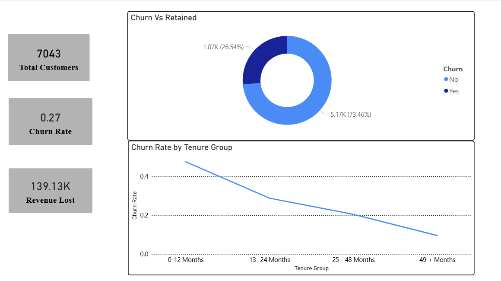
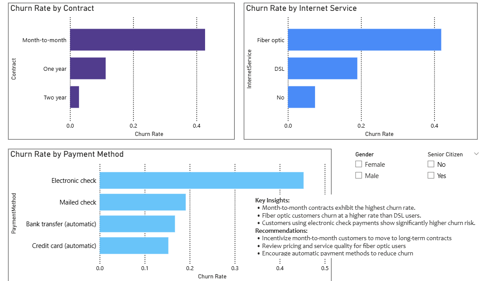
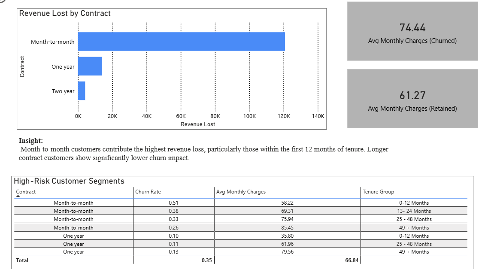

# Customer Churn Analysis & Revenue Impact Dashboard

## Project Overview

Customer churn is a major challenge for subscription-based businesses. This repository contains an exploratory analysis, modeling, and a small dashboard-style summary showing churn drivers and estimated revenue impact.

## Contents

- Notebook: `Notebook/03_modeling_and_Evalution.ipynb` — modeling and evaluation workflow
- Visuals: `Images/` — charts and executive graphics used in the report

## Visual Summary

Below are the key visuals created for the project. Open the images in the `Images` folder for full-resolution versions.

- Executive Overview

  

  High-level summary of churn rates, cohort trends and recommended actions for leadership.

- Churn Drivers

  

  Feature importance and segmented analysis showing the primary drivers of churn.

- Revenue Impact

  

  Estimated monthly revenue at risk from projected churn and opportunity estimates from retention actions.

## How to Use

1. Open the notebook: `Notebook/03_modeling_and_Evalution.ipynb` and run cells to reproduce analysis and figures.
2. Refer to the images in `Images/` for presentation-ready visuals.
3. If you want the images renamed or re-exported (e.g., remove spaces, change formats), tell me and I can update them.

## Next Steps

- Clean filenames (optional): replace spaces with dashes or underscores for CI compatibility.
- Add a small `assets` subfolder if you want published dashboards to reference static images.

---

If you'd like, I can (a) rename the image files to remove spaces and update the README links, (b) optimize PNGs for smaller size, or (c) add a one-page HTML preview that embeds these visuals.
